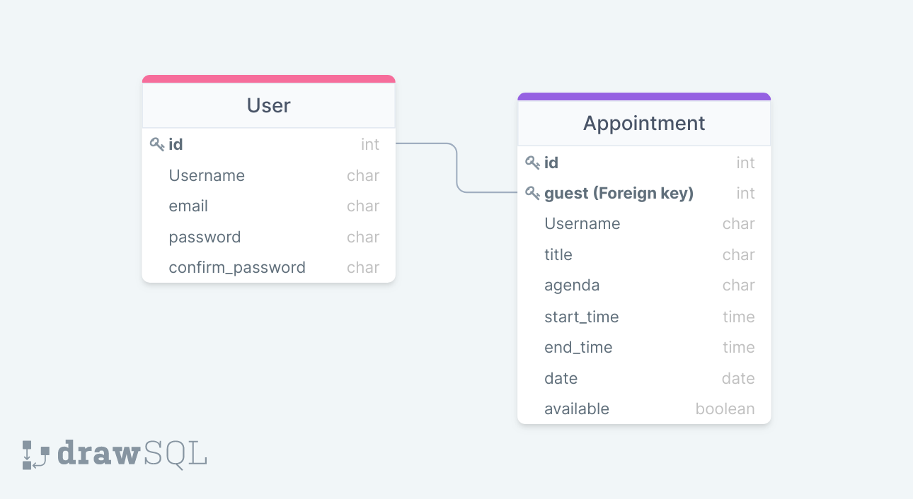

# Nbyula_Assignment

# Meet

## \_Schedule Meet with terraformers

Meet is a django based application for making schedule

## Features

- user can see all appointments
- user can see all upcoming appointment
- user can schedule an appointment
- can register users
- user can update their profile
- user can set off hours
- user can delete appointment
- generate token of authentication
- generate refresh token for authentication

## Tech

- [Django](https://www.djangoproject.com)
- [Django-Rest-framework](https://www.django-rest-framework.org)

## Routes

```sh
        'GET': '/api/'
        'GET': '/api/allAppointments/'
        'GET': '/api/upcomingAppointment/'
        'POST': '/api/scheduleAppointment/'
        'POST': '/api/register/'
        'POST': '/api/UpdateProfile/'
        'POST': '/api/offHours/'
        "DELETE": '/api/deleteAppointment/id/'

        'POST': '/api/token/'
        'POST': '/api/token/refresh/'
```

## Installation

having a virtual environment is good and in python3 we can do something like

```sh
python3 -m venv env
source env/bin/activate 'activate virtual environment for mac and linux machine'
pip install django
django-admin startproject <your-project-name> .
```

## Postman
- under api/sheduleAppointment/ pass all these parameters in raw
> Note: `guest` is an id example 1 or 2 etc.
```sh
       {
        "Username": "your name",
        "title": "some title",
        "agenda":"some agenda",
        "date": "some date",
        "start_time":"some start_time",
        "end_time":"some end_time",
        "guest": "guest_id"
      } 
```
- under api/token/ pass all these parameters in body -> form-data
```sh
    username: <your username>
    password: <your password>
```
- under api/offHours/ pass all these parameters in raw
```sh
      {
        "date": "some date",
        "start_time":"some start_time",
        "end_time":"some end_time",
        "guest": "guest_id"
      }
```
- under api/register/ pass all these parameters in body -> form-data
```sh
    username: <your username>
    email: <your email>
    password: <your password>
    confirm_password: <your password>
```
- under api/UpdateProfile/ pass all these parameters in body -> form-data
```sh
    username: <your username>
    old_password: <your old password>
    new_password: <your new password>
    confirm_password: <your new password>
```


## Schema


## Deployed
- You can use the URL below
- [Meet-terraformers](https://meet-terraformers.herokuapp.com)

> Note: `add /api/ in the end of routes` is required for Routes.

